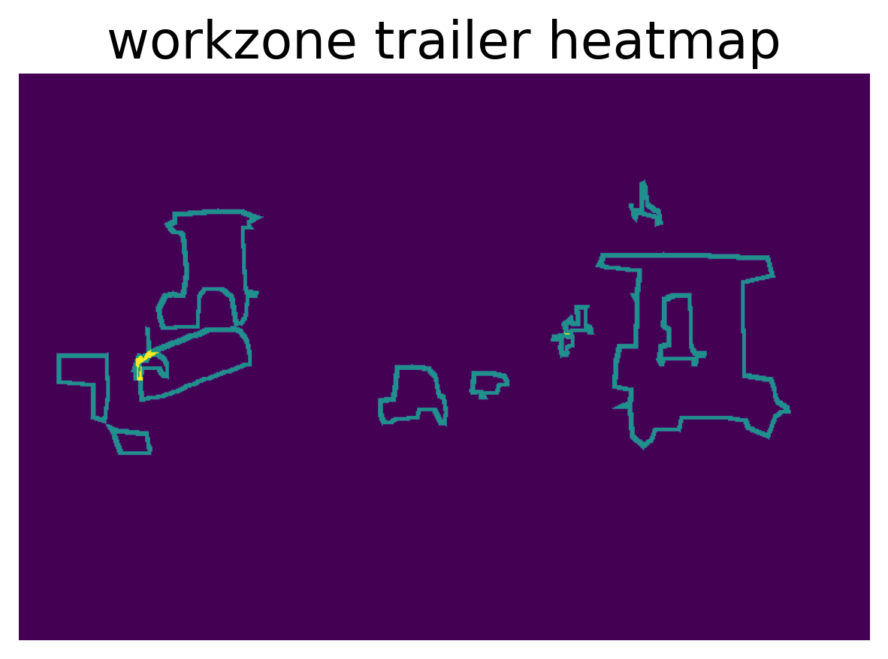

# Work Zone Detection

# Setting up Docker Environment and Dependencies
<ul>
    <li>Step 1: Pull docker image 
        <pre>docker pull vtti/workzone-detection</pre>
    </li>
    <li>Step 2: Clone the repository to local machine 
        <pre>git clone https://github.com/VTTI/Segmentation-and-detection-of-work-zone-scenes.git</pre>
    </li>
    <li>Step 3: cd to local repository 
        <pre>cd [repo-name]</pre>
    </li>
    <li>Step 4: Run container from pulled image and mount data volumes
        <pre>docker run -it --rm -p 9999:8888 -v $(pwd):/opt/app vtti/workzone-detection</pre>
    </li>You may get an error <pre>failed: port is already allocated</pre>
    If so, expose a different port number
    <li>If you wish to run the jupyter notebook, type 'jupyter' on the container's terminal</li>
    <li>On your local machine perform port forwarding using
        <pre>ssh -N -f -L 9999:localhost:9999 host@server.xyz </pre>
    </li>
</ul>

# Dataset Information

We introduce a new dataset called VTTI-WZDB2020, which is intended to aid in the development of automated systems that
can detect work zones.The dataset consists of work zone and non-work zone scenes in various naturalistic driving
conditions.  

Organize the data as follows
<pre>
./
 |__ data
        |__ Delivery_1_Workzone
        |__ Delivery_2_new
        |__ test (provided)
</pre>

# Dataset Analysis

The statistic analysis of the data is presented for convenience in ./ipynb/analysis_workzone.ipynb. Additionally,
individual results are present under ./output/analysis

### Color Distribution

<table style="padding: 10px">
    <tr>
        <td> </td>
        <td> </td>
        <td> </td>
        <td> </td>
        <td> </td>
    </tr>
    <tr>
         <td> </td>
        <td> </td>
        <td> </td>
        <td> </td>
        <td> </td>
    </tr>
</table>

### Heat Maps

<table style="padding: 10px">
    <tr>
        <td> </td>
        <td> </td>
        <td> </td>
        <td> </td>
        <td> </td>
    </tr>
    <tr>
        <td> </td>
        <td> </td>
        <td> </td>
        <td> </td>
        <td> </td>
    </tr>
</table>

### Object Distribution

<table style="padding: 10px">
    <tr>
         <th style="text-align: center">Distribution of Work Zone Objects Per Image</th>
         <th style="text-align: center">Instance Distribution Of Work Zone Objects</th>
     </tr>
    <tr>
        <td> </td>
        <td> </td>
    </tr>

</table>

### Pixel Distribution

<table style="padding: 10px">
    <tr>
         <th>Pixel Distribution</th>
     </tr>
    <tr>
        <td> </td>
    </tr>
</table>

# Model 1: Work Zone Object Segmentation with UNet

The first model is based on Unet architecture [1]. The configurations to run the Unet model are present in
./configs/config_unet.yaml. One can choose different backbones based on [1]. Also, the available choices for optimizers
are: 'ADAM', 'ASGD', 'SGD', 'RMSprop' & 'AdamW'.

## Training & Testing

To train the model, give the required values in the config file. All the outputs will be stored under ./output
<pre>
cd /opt/app
python run_unet.py \
--config [optional:path to config file] --mode ['train', 'test', 'test_single'] \
--comment [optional:any comment while training] \
--weight [optional:custom path to weight] \
--device [optional:set device number if you have multiple GPUs]
</pre>

For example, if one decides to change any parameter within the code to retrain the model, adding comment parameter will
create new folder to separate out results from different runs.  
Using --mode as "train", trains the model and preforms testing on the test set as well. To run test on single images run
<pre>
cd /opt/app
python run_unet.py --mode "test_single"
</pre>

New images can be added to ./data/test directory to perform additional testing on those images. Open source work zone
images are also provided in the /data/test directory to perform cross-dataset testing. Also, custom path to weights can
be provided for testing on images using --weight parameter (only applicable for testing on custom images present under
./data/test). By default, the best model path will be used. The training parameters are present below:-

| Training Parameters    | Values | 
| ------------- |-------------:|
| MODEL         | Unet          |
| BACKBONE      | efficientnet-b0 | 
| EPOCHS        | 50            |
| LR            | 0.001         |
|RESIZE_SHAPE   | (480, 480)    |
|BATCH_SIZE     | 16            |
|OPTIMIZER      | AdamW         |
| #TRAINING Imgs. | 1643        |
| #VALIDATION Imgs.| 186        |

## Results

The best F1 score achieved on testing set of 173 images: 0.5869

<table style="padding:10px">
  <tr>
    <th style="text-align: center">Original Image</th>
    <th style="text-align: center">Predicted Work Zone Objects</th>
  </tr>
  <tr>
    <td> </td>
    <td></td>
   </tr> 
   <tr>
      <td></td>
      <td>
  </td>
  </tr>
</table>

# Model 2: Work Zone Object Segmentation With UNet Using Image Patches

To run the model:
<pre>
cd /opt/app
python run_unet_patch.py \
--config [optional:path to config file] \
--mode ['train', 'test', 'test_single'] \
--comment [optional:any comment while training] \
--weight [optional:custom path to weight] \
--device [optional:set device number if you have multiple GPUs]
</pre>

Training Parameters:

| Training Parameters    | Values | 
| ------------- |-------------:|
| MODEL         | Unet          |
| BACKBONE      | densenet169 | 
| EPOCHS        | 100            |
| LR            | 0.001         |
|CROP_SHAPE   | (224, 224)    |
|BATCH_SIZE     | 32            |
|OPTIMIZER      | AdamW         |
| #TRAINING Imgs. | 1643        |
| #VALIDATION Imgs.| 186        |

## Results

The best F1 score achieved on testing set of 173 images: 0.611

<table style="padding:10px">
  <tr>
    <th style="text-align: center">Original Image</th>
    <th style="text-align: center">Predicted Work Zone Objects</th>
  </tr>
  <tr>
        <td></td>
        <td>
  </tr> 
   <tr>
        <td> </td>
        <td></td>
  </tr>
</table>

Additional results are present in ./output directory

# Model 3: Work zone Classification
To run the model

<pre>
cd /opt/app
python run_baseline.py \
--config [optional:path to config file] \
--mode ['train', 'test', 'test_single'] \
--comment [optional:any comment while training] \
--weight [optional:custom path to weight] \
--device [optional:set device number if you have multiple GPUs]
</pre>

Training Parameters:

| Training Parameters    | Values | 
| ------------- |-------------:|
| MODEL         | Unet          |
| BACKBONE      | resnet18 | 
| EPOCHS        | 25            |
| LR            | 0.001         |
|RESIZE_SHAPE     | (240, 360)    |
|BATCH_SIZE     | 32            |
|OPTIMIZER      | AdamW         |
| #TRAINING Imgs. | 4250        |
| #VALIDATION Imgs.| 514        |

<table style="padding: 10px">
    <tr>
         <th>Normalized confusion matrix</th>
     </tr>
    <tr>
        <td> </td>
    </tr>
</table>
Additional results are present in ./output directory

## Citation
[1]  https://github.com/qubvel/segmentation_models.pytorch  
[2]  https://github.com/pytorch/pytorch 
